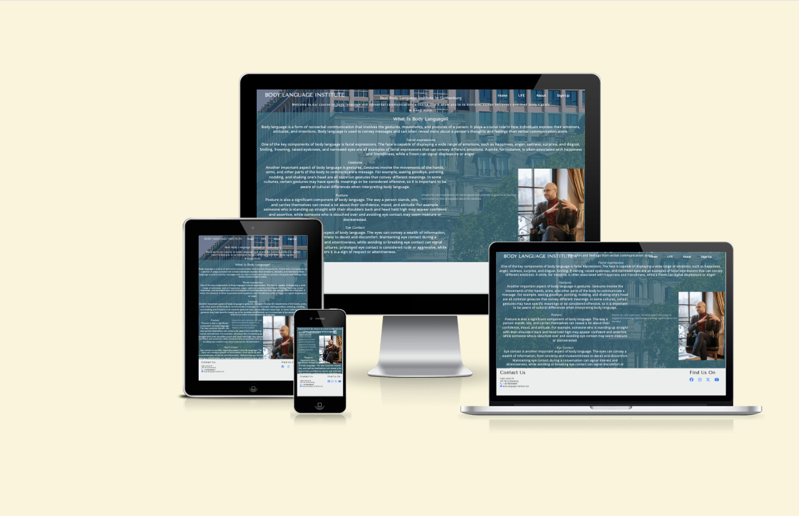
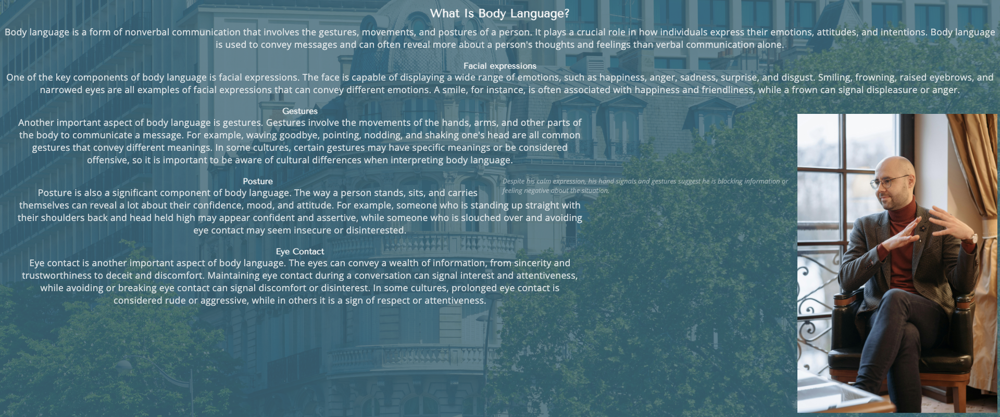
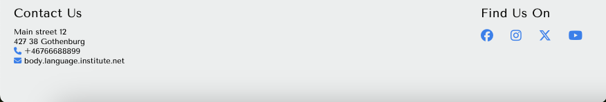
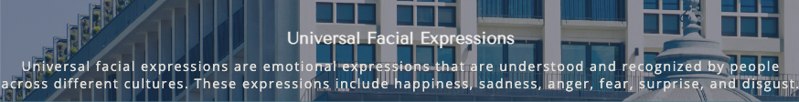
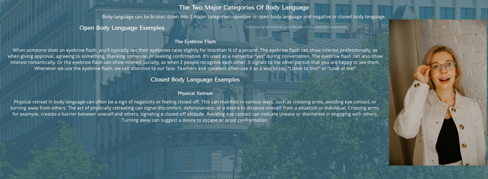
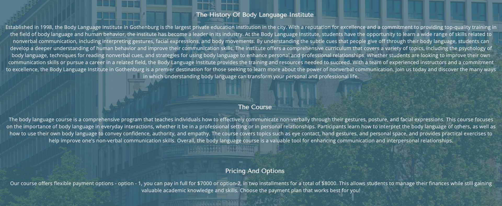
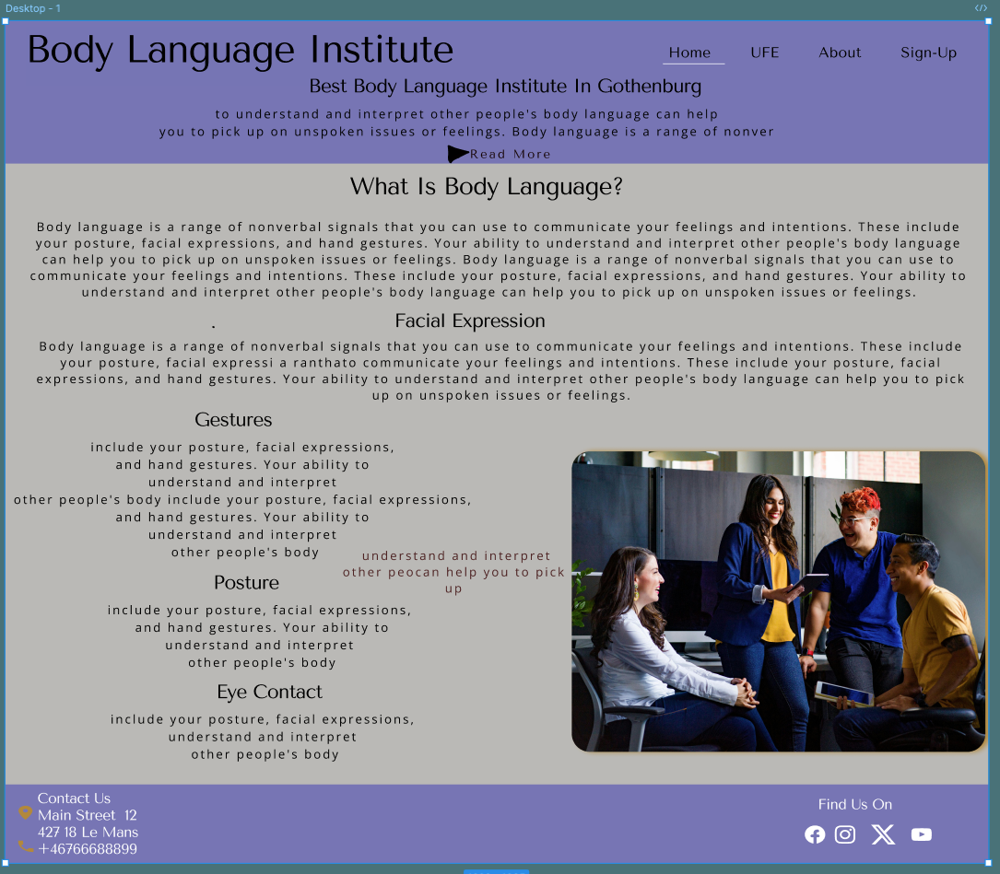
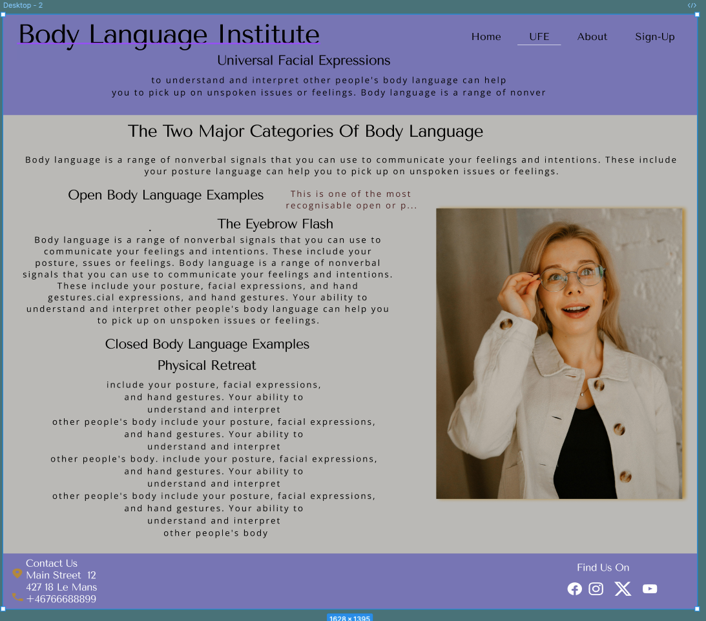
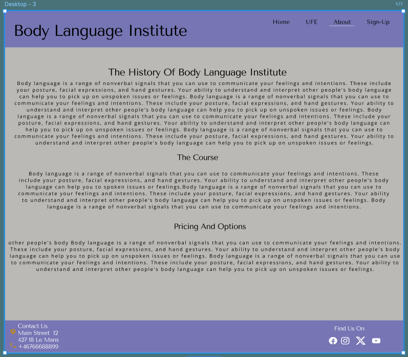
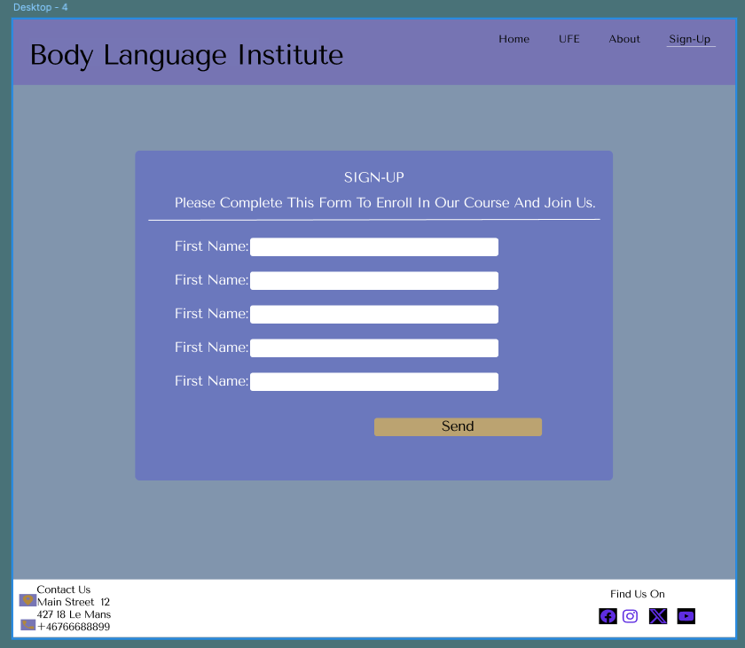

# Body Language Institute

Body language Institute website is for a school where people learn body language and practice reading people's actions and behaviors. This website gives them the answers they've been looking for long time "nonverbal communications". The site is the introduction about the body language courses and motivation to the one's who interested to know more about the nonverbal communications. And it's also for the people who want to improve their communication techniques.

## Features 

### Existing Features

- __Navigation Bar__

  - Navigation bar includes links to all four pages home, about, ufe and sign-up page. Navigation bar is full responsive and consistent.
  - The user can navigate easily using navigation bar from page to page. 

- __The Intro Section__

  - This part of the page has background-image of the Institute and some introduction text about the Institute. 
  - The intro section has also feature that allows the user can learn more about the course.

- __The Topic Section__

  - The topic section has text that give the user introduction about the body language and key compenets of physical body signals or actions. 
  - This part of the page answers the main questions of the body language. 

- __The Footer__ 

  - The footer section contains important information such as contact details, social media links. It provides additional resources for users. 
  - Users can also hover over or click on the footer links to access more detailed information about the website and its contents. If they have any specific questions or need further clarification, users can also reach out to the website's contact information provided in the footer.

- __Facial Section__ 

  - The facial section describes and explains what ufe is and tells to the user the key components of emotional expression. 
  - The user can learn what is emotional expression and how to undrstand it.

- __Define Section__ 

  - While the define section defines the two major categories of body language and gives the user the ability to understand the difference between physical signals and emotional feelings. 
  - The picture tells how a person looks like when the eyebrow flashing and the text describes difference between open and closed body language.

- __The About Page__

  - This page is valuable both to the user and the institute, the users can get the answers of the course, options they have when it come the payment options and they can get the information or the history about the institute.  
  - The institute gives the user the curriculum, the two option payment plans and confidence to choose in this particular institute to learn non verbal communications because of their experience and well educated instructors. 

- __The Sign Up Page__

  - This section will allow the user to send their personal information and payment option to learn the body language "Nonverbal Communication" course.
  - In the sign up page the user will be asked to submit their first, last name, email, phone number, and the payment option they would like to choose.
  - Users can fill out and send forms effortlessly to get in touch and register for courses.

### Features Left to Implement

- Make payment option in a separate section.

## UX/UI

### User Goals
- Users should learn why body language is a crucial aspect of nonverbal communication and how it impacts interpersonal interactions.
- Users should easily find information about available courses, including details on content, schedule, and enrollment.
- Users should be able to navigate the website effortlessly and find the information they need without confusion.

### Target Audience
  - For people who want to learn how to read and use body language to build better relationships, be more persuasuve, and understand others better.
  - Students and researchers interested in psychology, human behavior, or communication studies.
  - People who want to refine their body language skills to enhance their performances, ensuring that their physical expressions align with their roles and messages.

### User Stories
  - As a study adviser, I need to find an institute that offers nonverbal communication courses, so I can guide students seeking to enhance their communication skills.
  - As a sales professional, I want to learn how to read my clients' body language, so that I can adjust my approach and increase my chances of closing deals.
  - As a student, I need information and an introduction to body language courses, so I can decide if the institute meets my needs and expectations.
  - As a private student, I need to be able to contact the institute, so I can get personalized information and support.
  - As a background checker, I need to know the history of the institute, so I can verify its credibility and reputation.
  - As a user, I want the ability to submit forms and choose payment options, so I can complete my enrollment or purchase smoothly.

## Mockups
  - I use simple, consistent page layouts were used across four pages.

### Landing Page 
  

### UFE Page 
  

### About Page 
  

### Sign-up Page 
  

## Tools & Technologies Used

-  used for version control. (`git add`, `git commit`, `git push`)
-  used for secure online code storage.
-  used as a cloud-based IDE for development.
-  used for the main site content.
-  used for the main site design and layout.
-  used for hosting the deployed front-end site.
-  used for creating wireframes.
-  used for the icons.
-  used to help debug, troubleshoot, and explain things.

## Testing

- You can find the testing document in the. 
* * 

### Validator Testing 

- HTML
  - No errors were returned when passing through the official [W3C validator](Read in text.info in assets)
- CSS
  - No errors were found when passing through the official [(Jigsaw) validator](Read in text.info in assets)

## Deployment

- The site was deployed as follows: 
  - Site was deployed on Github
  - [Deployed Site](https://zakariyenor.github.io/silver-engine/)

## Credits 

- I took some of the text on the page from [Science Of People](https://www.scienceofpeople.com/)
- Some text was been generated chatgpt [Chatgpt](https://chatgpt.com/)
- The icons in the footer were taken from [Font Awesome](https://fontawesome.com/)
- The font-family and font-types took from [Google Font](https://fonts.google.com/?preview.layout=grid)
- Got extra help from tutor assistance [Code Institute](https://learn.codeinstitute.net/ci_support/diplomainfullstacksoftwarecommoncurriculum/tutor)

### Media

-  I downloaded the pictures on the pages (home, ufe and background-img) from [Pexels](pexels.com)

