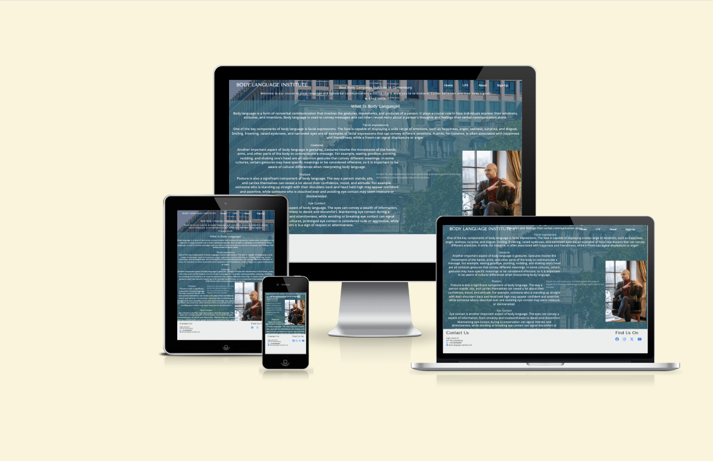
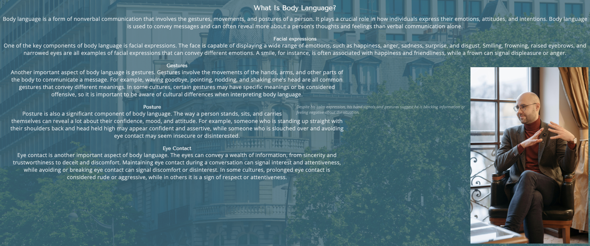
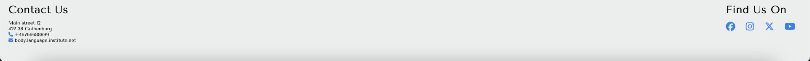
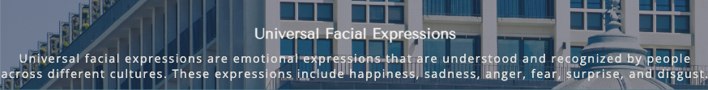
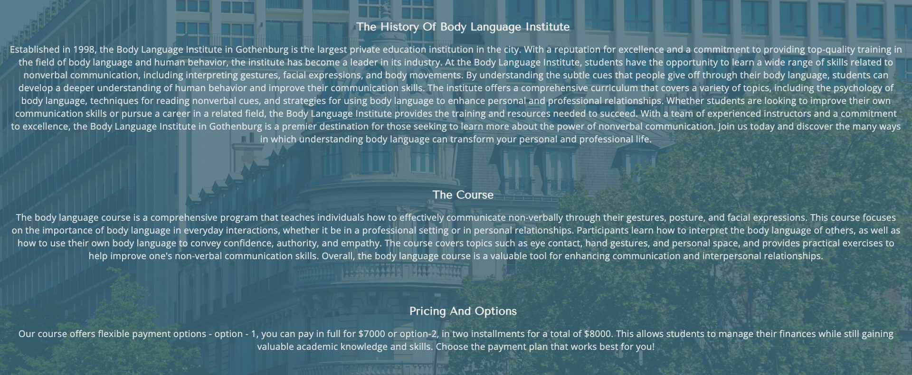

# Love Running

Body language Institute website is for a school where people learn body language and practice reading people's actions and behaviors. This website gives them the answers they've been looking for long time "nonverbal communications". The site is the introduction about the body language courses and motivation to the one's who interested to know more about the nonverbal communications. And it's also for the people who want to improve their communication techniques.

## Features 

### Existing Features

- __Navigation Bar__

  - Navigation bar includes links to all four pages home, about, ufe and sign-up page. Navigation bar is full responsive and consistent.
  - The user can navigate easily using navigation bar from page to page. 

- __The Intro Section__

  - This part of the page has background-image of the Institute and some introduction text about the Institute. 
  - The intro section has also feature that allows the user can learn more about the course.

- __The Topic Section__

  - The topic section has text that give the user introduction about the body language and key compenets of physical body signals or actions. 
  - This part of the page answers the main questions of the body language. 

- __The Footer__ 

  - The footer section contains important information such as contact details, social media links. It provides additional resources for users. 
  - Users can also hover over or click on the footer links to access more detailed information about the website and its contents. If they have any specific questions or need further clarification, users can also reach out to the website's contact information provided in the footer.

- __Facial Section__ 

  - The facial section describes and explains what ufe is and tells to the user the key components of emotional expression. 
  - The user can learn what is emotional expression and how to undrstand it.

- __Define Section__ 

  - While the define section defines the two major categories of body language and gives the user the ability to understand the difference between physical signals and emotional feelings. 
  - The picture tells how a person looks like when the eyebrow flashing and the text describes difference between open and closed body language.

- __The About Page__

  - This page is valuable both to the user and the institute, the users can get the answers of the course, options they have when it come the payment options and they can get the information or the history about the institute.  
  - The institute gives the user the curriculum, the two option payment plans and confidence to choose in this particular institute to learn non verbal communications because of their experience and well educated instructors. 

- __The Sign Up Page__

  - This section will allow the user to send their personal information and payment option to learn the body language "Nonverbal Communication" course.
  - In the sign up page the user will be asked to submit their first, last name, email, phone number, and the payment option they would like to choose.

### Features Left to Implement

- Make payment option in a separate section.

## Testing

- You can find the testing document in the. 
* * Silver-engine/assets/text.info

### Validator Testing 

- HTML
  - No errors were returned when passing through the official [W3C validator](Read in text.info in assets)
- CSS
  - No errors were found when passing through the official [(Jigsaw) validator](Read in text.info in assets)

## Deployment

- The site was deployed as follows: 
  - Site was deployed on Github
  - [Deployed Site] (https://zakariyenor.github.io/silver-engine/)

## Credits 

- I took some of the text on the page from [Science Of People](https://www.scienceofpeople.com/)
- Some text was been generated chatgpt [Chatgpt](https://chatgpt.com/)
- The icons in the footer were taken from [Font Awesome](https://fontawesome.com/)
- The font-family and font-types took from [Google Font](https://fonts.google.com/?preview.layout=grid)
- Got extra help from tutor assistance [Code Institute](https://learn.codeinstitute.net/ci_support/diplomainfullstacksoftwarecommoncurriculum/tutor)

### Media

-  I downloaded the pictures on the pages (home, ufe and background-img) from [Pexels](pexels.com)